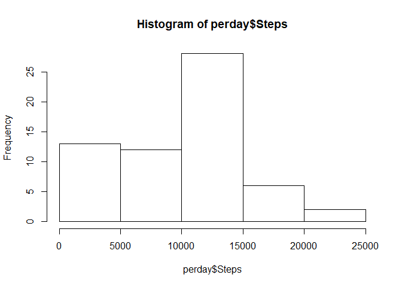

## Loading and preprocessing the data

```r
library(readr)
suppressMessages(library(dplyr))
library(ggplot2)
library(formattable)


#1. Load the data ...
col_types <- cols(
  steps = col_double(),
  date = col_date(format = ""),
  interval = col_double()
)
activity <- read_csv("activity.zip", col_types = col_types)

#2. Process/Transform ...
  #Not Nessiary
```


## What is mean total number of steps taken per day?


```r
#1. Calculate the total number of steps taken per day

perday <- activity  %>%
  group_by(date ) %>%
  summarise(Steps = sum(steps,na.rm = TRUE))


#2. Make a histogram of the total number of steps taken each day

hist(perday$Steps)
```

<!-- -->

```r
#3. Calculate and report the mean and median of ...

stepsmean <- mean(perday$Steps, na.rm = TRUE)

stepsmedian <- median(perday$Steps, na.rm = TRUE)
```
Then mean number of steps is 9,354 and the median number of steps is 10,395.


## What is the average daily activity pattern?


```r
#1. Make a time series plot ...

perinterval <- activity  %>%
  group_by(interval ) %>%
  summarise(DailyAverage = mean(steps,na.rm = TRUE))

ggplot(perinterval, aes(x=interval)) +
geom_line(aes(y=DailyAverage)) + theme_set(theme_light()) +  ylab("Daily Average") + xlab("5-minute interval") 
```

<!-- -->

```r
#2. Which 5-minute interval, on average across all the days in the dataset, contains the maximum number of steps?

maxnumberofsteps <- perinterval[perinterval$DailyAverage == max(perinterval$DailyAverage),]
```

Interval 835 is the 5-Minute interval which on average had the maximum number of steps accross all days. 


## Imputing missing values


```r
#1. Calculate and report the total number of missing values

naactivity <- subset(activity, is.na(activity$steps))
numberofnavalues <- nrow(naactivity)
```
The total number of NA values is 2304.


```r
#2. Devise a strategy for filling in all of the missing values.  
#
#  Using Mean for NA 5 minute intervals

#3. Create a new dataset that is equal to the original 
#   dataset but with the missing data filled in. 
cleanactivity <- activity
for (interval in perinterval$interval) {
    cleanactivity[is.na(cleanactivity$steps) 
                  & cleanactivity$interval == interval, "steps" ] <-
      perinterval[perinterval$interval == interval ,"DailyAverage"]
  
}

#4. Make a histogram of the total number of steps taken each day and 
### Calculate and report the mean and median total number of steps taken 
### per day. Do these values differ from the estimates from the first part
### of the assignment? What is the impact of imputing missing data on the 
### estimates of the total daily number of steps?

#new histagram with NA's removed
cleanperday <- cleanactivity  %>%
  group_by(date ) %>%
  summarise(Steps = sum(steps,na.rm = TRUE))

hist(cleanperday$Steps)
```

<!-- -->

```r
#New Mean and Median with NA's removed
cleanstepsmean <- mean(cleanperday$Steps, na.rm = TRUE)

cleanstepsmedian <- median(cleanperday$Steps, na.rm = TRUE)
```

The mean number of steps once the missing values are replaced by average values is 10,766 and the median number of steps is 10,766. The original histogram was skewed due to missing data. Replacing the missing values with the average interval value un-skewes the data and the resulting  histogram  looks more like a normal distribution.  This normalization moves the center of the histogram, increasing the mean and making  the mean and median values more closely align.


## Are there differences in activity patterns between weekdays and weekends?


```r
#1. Create a new factor variable in the dataset with two levels -- "weekday" 
### and "weekend" indicating whether a given date is a weekday or weekend day.

cleanactivity[weekdays(cleanactivity$date ) %in% c("Saturday","Sunday"), "DayType"] <- "Weekend"
cleanactivity[!(weekdays(cleanactivity$date ) %in% c("Saturday","Sunday")), "DayType"] <- "weekday"
cleanactivity$DayType <- as.factor(cleanactivity$DayType)


#2 Make a panel plot containing a time series plot ...

#sum and group by interval and DayType
weektypeinterval <- cleanactivity  %>%
  group_by(interval, DayType ) %>%
  summarise(DailyAverage = mean(steps,na.rm = TRUE))

#Create Plot
ggplot(weektypeinterval) +
geom_line(aes(y=DailyAverage, x=interval)) + theme_set(theme_light()) +  
ylab("Average Number Of Steps") + xlab("5-minute interval") +
facet_grid(DayType ~ .)
```

<!-- -->


